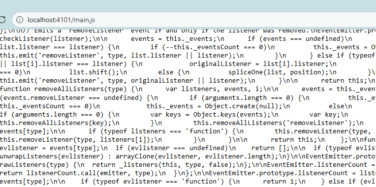
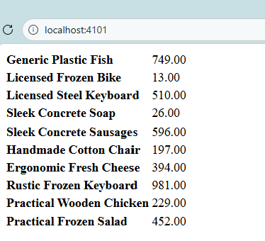

# Products Microfrontend

## WebPack
- WebPack combines multiple dependencies into a single file.
>  node_modules/** + index.js -> WebPack -> dist/main.js
- Similar to maven java and pom.xml

Configure the bundle in [webpack.config.js](webpack.config.js)

- Basic Webpack

```js
module.exports = {
	mode: 'development',
}
```
- compile modules
```shell
npm run start 
--> webpack
```

## WebPack Dev Server

- makes our js available to browser

- Webpack.config.js
```js
module.exports = {
	mode: 'development',
	devServer: {
		port: 4101
	}
}
```

```shell
npm run start
-> webpack serve
```

- Go to http://localhost:4101/main.js 



## Integrate JavaScript to HTML

- Add [index.html](public/index.html) to public folder
- In webpack.config.js add `HtmlWebpackPlugin`
- Restart webpack serve
- Now go to http://localhost:4101/
- Go to console


- Add a table container to html
- Update the container from javascript

```js

document.querySelector('#products-table').innerHTML = products;
```

- Now the products are displayed on the page

